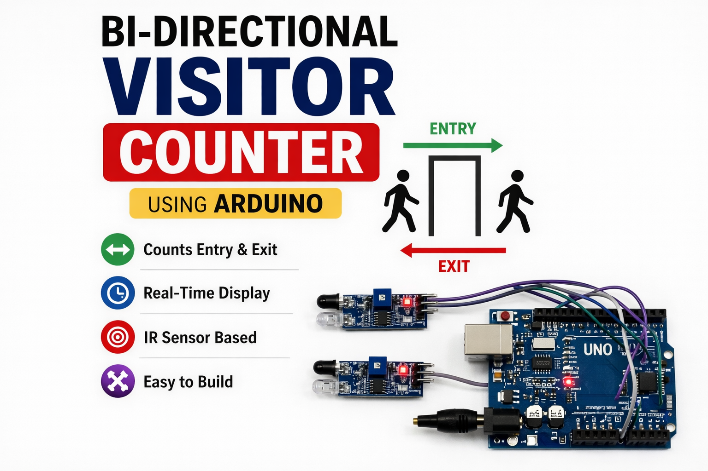
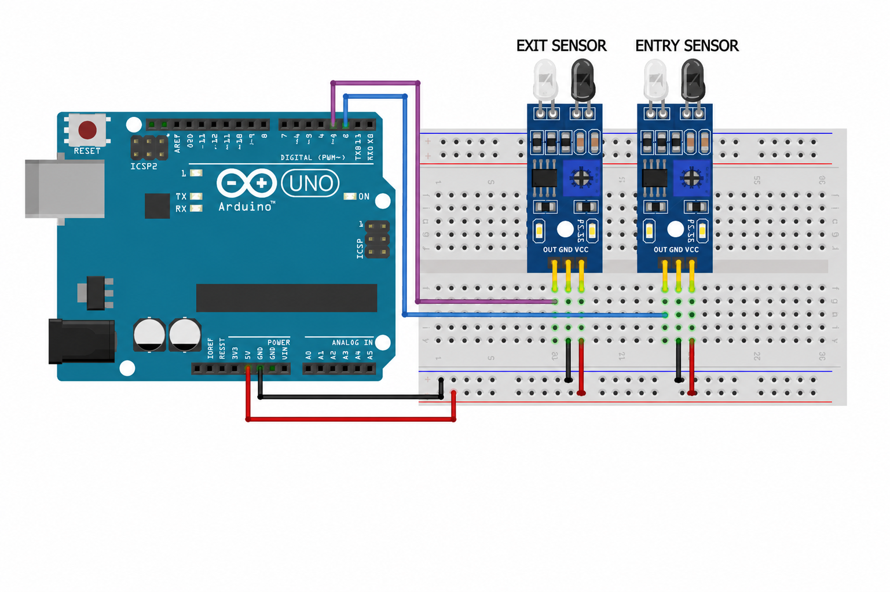

# 📊 BIDIRECTIONAL VISITOR COUNTER USING ARDUINO

<p align="center">
  
</p>

---

## Components Used

* Arduino UNO
* 2 × IR Sensors (Active LOW)
* Breadboard
* Jumper Wires
* USB Cable

---

# Introduction & Objective

## Introduction

The Bidirectional Visitor Counter is an Internet of Things (IoT)-based project that detects the number of people entering and exiting a room using IR sensors. The system uses two infrared sensors placed at a doorway to detect movement direction.

When a person crosses the sensors, the Arduino UNO determines whether the movement corresponds to an entry or an exit based on the sequence of sensor activation. The system maintains a real-time count of people inside and the total number of entries.

## Objective

The main objectives of this project are:

* To detect entry and exit movements using IR sensors.
* To count the number of people inside a room.
* To determine direction using sequence-based detection.
* To implement real-time monitoring using Arduino.
* To demonstrate IoT-based automation.

## Applications

This project can be used in various real-world applications, including:

1. **Smart Classrooms** – Monitoring student attendance.
2. **Office Spaces** – Tracking occupancy levels.
3. **Retail Stores** – Customer footfall analysis.
4. **Security Systems** – Monitoring restricted areas.
5. **Smart Buildings** – Automation based on occupancy.

---

# Circuit Connections

<p align="center">
  
</p>

## Arduino UNO ↔ Breadboard

| Arduino Pin | Breadboard Connection |
|------------|----------------------|
| 5V         | Positive (+) Rail    |
| GND        | Negative (-) Rail    |

---

## IR Sensor Connections

| IR Sensor Pin | Connected To            |
|--------------|------------------------|
| VCC          | Breadboard + Rail (5V) |
| GND          | Breadboard - Rail (GND)|
| OUT (Sensor 1)| Digital Pin 2         |
| OUT (Sensor 2)| Digital Pin 3         |

---

## Pin Mapping Summary

| Arduino Pin | Component     |
|------------|--------------|
| D2         | IR Sensor 1  |
| D3         | IR Sensor 2  |
| 5V         | Power Rail   |
| GND        | Ground Rail  |

---

## Wiring Notes

1. Arduino 5V is connected to the breadboard positive rail.
2. Arduino GND is connected to the breadboard negative rail.
3. Both IR sensors receive power from the breadboard rails.
4. Sensor outputs are connected to Digital Pins 2 and 3.
5. Sensors must be aligned properly for accurate detection.

---

# Working Principle

The system works by detecting the order in which the IR sensors are triggered.

### Working Steps

1. A person crosses the doorway.
2. IR sensors detect the interruption.
3. If **Sensor 1 triggers first, then Sensor 2 → Entry**.
4. If **Sensor 2 triggers first, then Sensor 1 → Exit**.
5. Arduino updates the count accordingly.
6. Data is displayed via Serial Monitor.

---

### Flow of Operation

```text
Person Crosses Door
        ↓
IR Sensors Triggered
        ↓
Sequence Detected
        ↓
Entry or Exit Determined
        ↓
Count Updated
        ↓
Displayed on Serial Monitor
        ↓
Repeat Continuously
Results, Advantages and Conclusion
Results
```

## The Bidirectional Visitor Counter was successfully developed and tested. The following results were achieved:

- Accurate detection of entry and exit.

- Real-time counting of people inside.

- Reliable sequence-based direction detection.

- Stable performance using IR sensors and Arduino.

## Conclusion

The Arduino-based Bidirectional Visitor Counter effectively tracks the number of people entering and exiting a space using IR sensors. The system uses simple logic to determine direction and maintain an accurate count.

This project demonstrates the practical application of sensors, microcontrollers, and real-time processing in IoT systems. It serves as a strong foundation for building more advanced smart monitoring systems.
